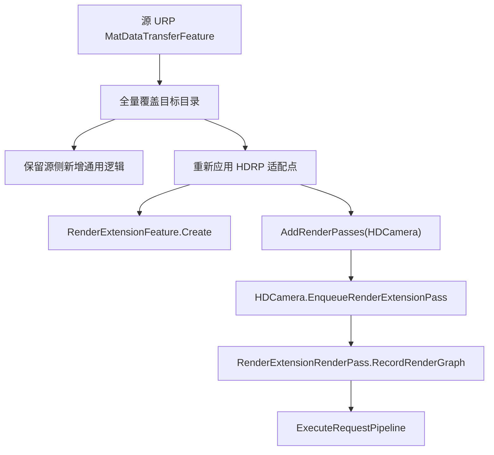

# MatDataTransferFeature 迁移同步说明

## 目录

- 源目录：`D:\_Proj\QTAU6\Packages\Q Render Pipeline\MatDataTransferFeature`
- 目标目录：`E:\ProjectWangyue\wangyue\client\Packages\WangYue-RenderPipeline\WangYueRenderExtensionPackages\Features\MatDataTransferFeature`

## 同步原则

源目录是功能代码的主版本，重新迁移时先把源目录整体拷贝覆盖到目标目录。

也就是说：业务数据结构、Instance、Provider、Resolver、Logger、PublicAPI、ShaderBinding、Editor 面板工具，以及 feature 接入文件里的通用字段、Editor 辅助逻辑，都可能在源工程继续修改。同步时不要因为某个文件需要 HDRP 适配就跳过它，否则会漏掉源侧新增逻辑。

需要注意的是：下面这些文件可以从源目录覆盖到目标目录，但覆盖后必须重新应用目标工程适配点。

| 文件 | 覆盖后需要重新适配的原因 |
| --- | --- |
| `Runtime/Core/Feature/MatDataTransferFeature.cs` | 源版继承 URP `ScriptableRendererFeature`，目标版必须继承 HDRP 自实现的 `RenderExtensionFeature` |
| `Runtime/Core/Feature/MatDataTransferFeature.Pass.cs` | 源版使用 URP `ScriptableRenderPass`，目标版必须使用 `RenderExtensionRenderPass` 并通过 `HDCamera` 入队 |
| `Runtime/REP.MatDataTransfer.Runtime.asmdef` | 源版依赖 URP Runtime，目标版需要依赖 HDRP Runtime |

`Editor/REP.MatDataTransfer.Editor.asmdef` 不属于 HDRP feature 生命周期适配点，但源版里带的 `QRenderPipeline.Editor` 或 URP 引用在目标工程没有对应程序集。同步覆盖后需要改回目标工程可用的引用。

## 目标工程适配方式



目标工程里，`MatDataTransferFeature` 不再挂到 URP RendererData 上，而是作为 HDRP Global Settings 里的 Render Extension Feature 被调用。

执行链路是：

1. HDRP 收集启用的 `RenderExtensionFeature`。
2. `MatDataTransferFeature.AddRenderPasses(HDCamera)` 同步当前活跃 `MatDataTransferInstance`。
3. 如果没有活跃实例，不入队 pass。
4. 如果有活跃实例，将内部 pass 放入 `HDCamera.EnqueueRenderExtensionPass`。
5. 在 `RenderPassInjectionPoint.AfterPrepass` 执行 `ExecuteRequestPipeline`。
6. Pipeline 解析请求，并写入 `Material` 或 `MaterialPropertyBlock`。

## 从源目录重新同步的推荐步骤

1. 从源目录复制整个 `MatDataTransferFeature` 到目标目录，但排除 `MIGRATION_SYNC.md` 和 `MIGRATION_SYNC.md.meta`。这份文档只放在源目录，用来指导迁移，不作为 feature 资源进入目标工程。
2. 保留目标目录外层 `MatDataTransferFeature.meta`，避免 Unity 重新生成目录 GUID。
3. 覆盖后，重新应用本文件“覆盖后需要重新适配的文件”表格中的适配点。注意只替换渲染管线接入方式和程序集引用，不要丢掉源文件新增的业务字段、Editor 事件、工具方法等通用逻辑。
4. 检查是否还有 URP 残留：

推荐同步命令示例：

```powershell
robocopy `
  "D:\_Proj\QTAU6\Packages\Q Render Pipeline\MatDataTransferFeature" `
  "E:\ProjectWangyue\wangyue\client\Packages\WangYue-RenderPipeline\WangYueRenderExtensionPackages\Features\MatDataTransferFeature" `
  /MIR `
  /XF MIGRATION_SYNC.md MIGRATION_SYNC.md.meta
```

```powershell
rg -n "UnityEngine\.Rendering\.Universal|Unity\.RenderPipelines\.Universal|ScriptableRendererFeature|ScriptableRenderPass|RenderPassEvent" `
  "E:\ProjectWangyue\wangyue\client\Packages\WangYue-RenderPipeline\WangYueRenderExtensionPackages\Features\MatDataTransferFeature" `
  -g "*.cs" -g "*.asmdef"
```

预期：没有输出。

5. 检查新增 `.cs` 文件换行，C# 文件需要保持 CRLF。
6. 打开 Unity，让工程重新导入并编译。
